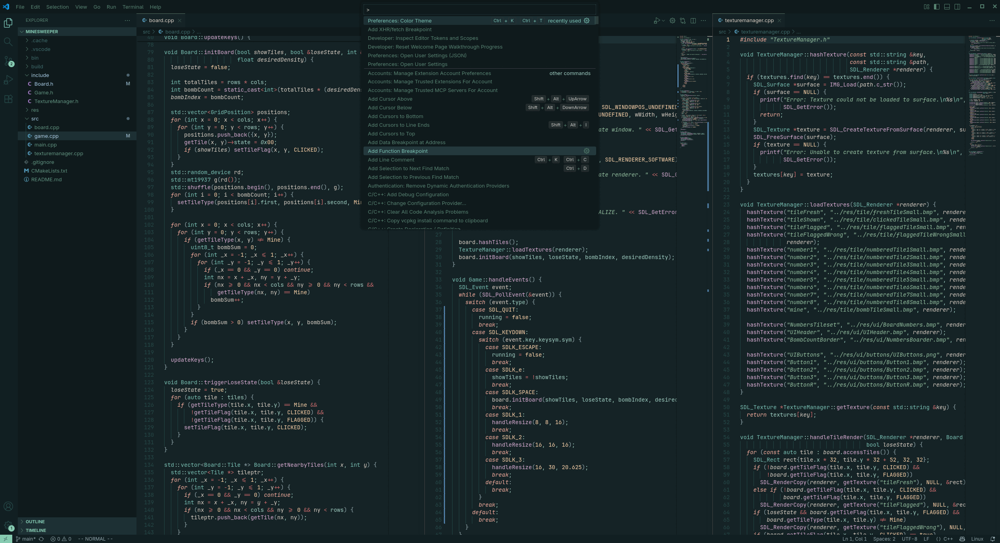
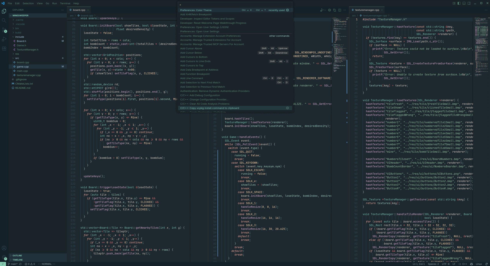
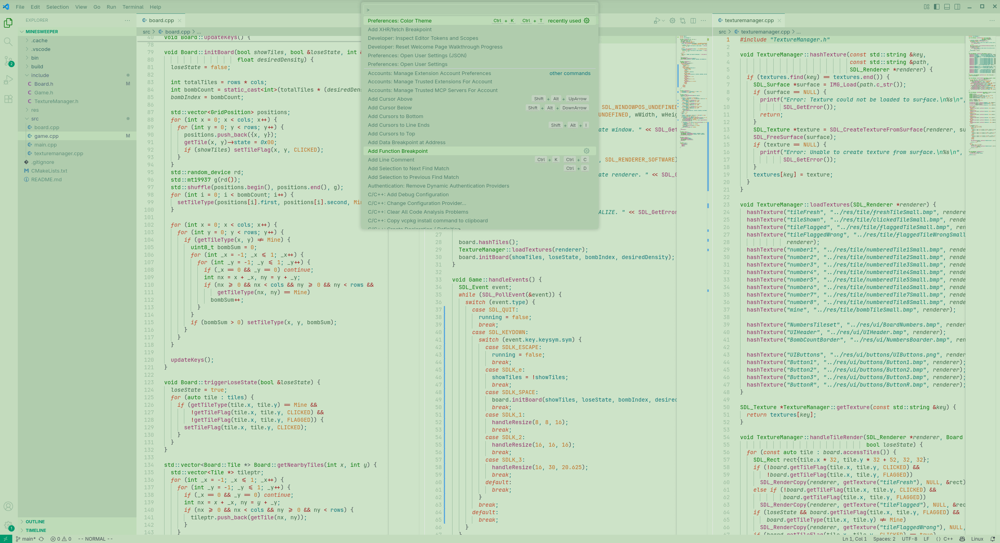
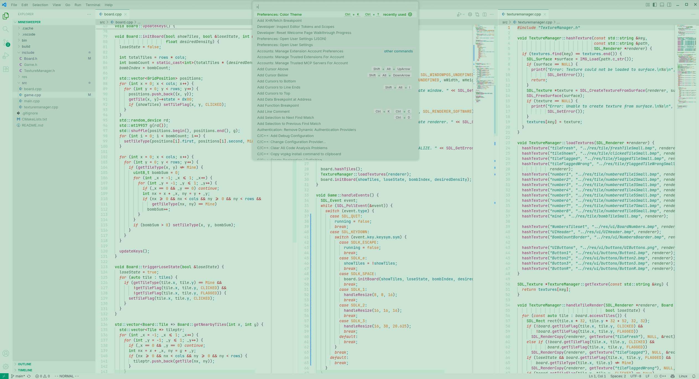

<h1 align="center">
    Thorn 
    
</h1>

A port of the Neovim colorscheme, [thorn.nvim](https://github.com/jpwol/thorn.nvim), made by me.

Features dark and light rich greens and low contrast UI to provide a pleasant working experience.

### Screenshots

Thorn Dark Warm

 

Thorn Dark Cold

 

Thorn Light Warm

 

Thorn Light Cold

 

---

### Extras

Additional goodies can be found [here](https://github.com/jpwol/thorn.nvim/tree/main/extras)!

- Ghostty themes
- Kitty themes
- Alacritty themes
- Btop themes

### Issues/Bugs

Any issues that might be encountered, please report them [here](https://github.com/jpwol/thorn-vscode-theme/issues) and I will take care of them as fast as possible.

#### Contributions

Special thanks to [ljennings98](https://github.com/ljennings98) for contributing to the project!
