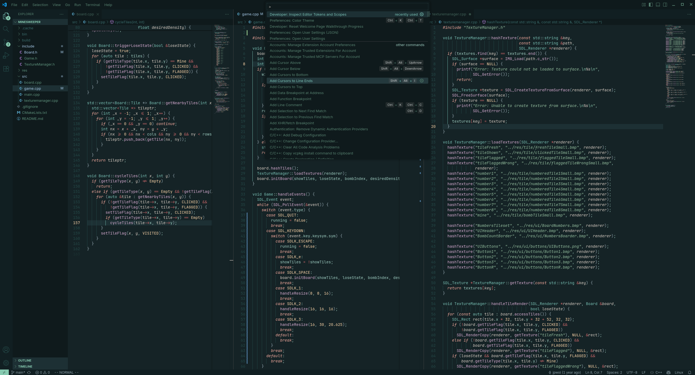

<h1 align="center">
    Thorn 
    
</h1>

A port of the Neovim colorscheme, [thorn.nvim](https://github.com/jpwol/thorn.nvim), made by me.

Features dark, rich greens and low contrast UI to provide a pleasant working experience.

### Screenshots

---

### Extras
Additional goodies can be found [here](https://github.com/jpwol/thorn.nvim/tree/main/extras)!
- Ghostty themes
- Kitty themes
- Alacritty themes
- Btop themes

### Issues/Bugs
Any issues that might be encountered, please report them [here](https://github.com/jpwol/thorn-vscode-theme/issues) and I will take care of them as fast as possible.